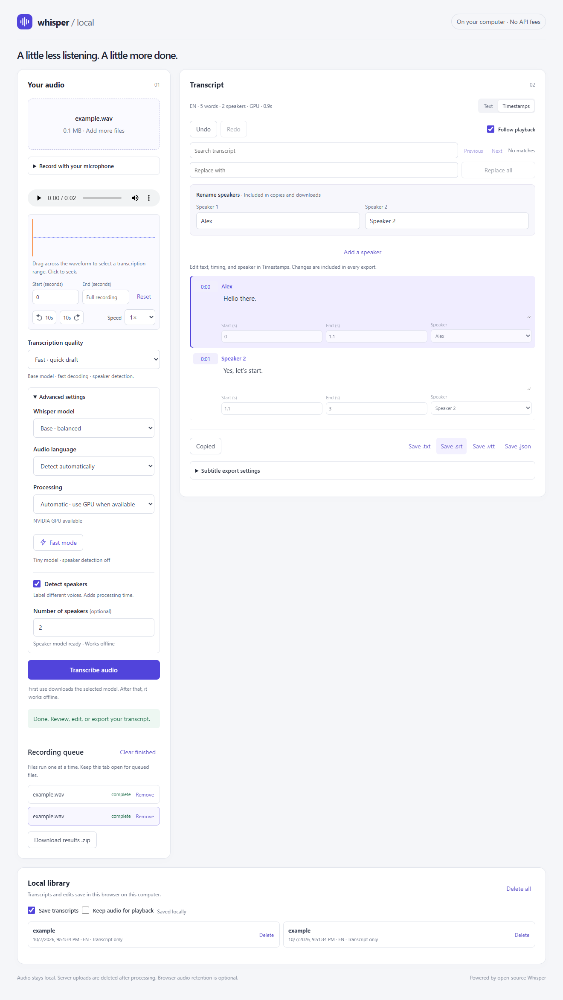

# Whisper Local

A small browser app for private audio transcription using OpenAI's open-source
Whisper models. Upload or record audio, transcribe on your computer, and export text
or subtitles. No OpenAI account, API key, or transcription fees.



_The screenshot uses a deterministic two-speaker fixture to demonstrate the UI._

## Features

- Drag-and-drop uploads and a sequential queue for multiple recordings.
- Microphone recording with pause, resume, preview, and discard controls.
- Synchronized transcript highlighting, optional follow scrolling, playback speed,
  skip controls, and clickable timestamps.
- Waveform selection or manual start/end times for transcribing part of a recording.
- Multilingual Tiny, Base, and Small models through faster-whisper.
- Automatic NVIDIA GPU acceleration with an INT8 CPU fallback.
- Fast, Balanced, and Accurate presets, with advanced model and CPU settings.
- Editable segments, speaker names and assignments, timing corrections, search
  and replace, and undo/redo. Corrections appear in copying and every export.
- TXT, SRT, VTT, and JSON exports, subtitle line/duration controls, and batch ZIP downloads.
- A browser-local transcript library with autosave, deletion, and optional audio retention.
- Stage progress, cancellation that stops inference, remembered settings, and
  recovery of the active job after refreshing the same browser tab.
- Local model caching, upload cleanup, and no application analytics.

## Quick start on Windows

1. Install the [Python install manager](https://www.python.org/downloads/windows/).
2. Clone or extract this repository.
3. Double-click **Start.cmd**. First launch runs setup and opens your browser.

Setup creates a private Python 3.11 runtime in `.runtime`. If an NVIDIA GPU is
detected, it installs CUDA-enabled PyTorch and its GPU libraries; that download
can be several GB. Other computers use CPU packages. A separate CUDA toolkit or
FFmpeg installation is not required. Audio decoding uses PyAV.

For a smaller CPU-only installation:

```powershell
powershell -NoProfile -ExecutionPolicy Bypass -File .\Setup.ps1 -CpuOnly
.\Start.cmd
```

Keep the launch window open while using the app. Close existing app instances
before rerunning setup. The default address is `http://127.0.0.1:8765`.

## Standard Python installation

Use Python **3.11 or 3.12**, with a virtual environment. For CPU inference:

```sh
python -m venv .venv
# Windows: .venv\Scripts\activate
# Linux: source .venv/bin/activate
python -m pip install -r requirements-engine.txt --index-url https://download.pytorch.org/whl/cpu
python -m pip install -e .
python -m whisper_local
```

For a compatible NVIDIA GPU, install `requirements-engine-gpu.txt` instead with
`--index-url https://download.pytorch.org/whl/cu128` before installing the app.
Windows is the verified inference platform. CI checks Python and browser behavior
on Windows and Linux without loading model weights. macOS/MPS acceleration has
not been implemented or verified.

The installed command `whisper-local` and `python -m whisper_local` accept:

```sh
python -m whisper_local --port 8766 --no-browser
```

The server always binds to loopback. If the selected port is occupied, it exits
with an explanation before opening the browser.

## Speaker detection

Whisper supplies text and timestamps; **pyannote Community-1** supplies speaker
turns. Enable **Detect speakers** in the app and follow its one-time setup:

1. Sign in to Hugging Face and accept the access conditions for
   [pyannote/speaker-diarization-community-1](https://huggingface.co/pyannote/speaker-diarization-community-1).
2. Create a [read access token](https://huggingface.co/settings/tokens).
3. Paste it into the app's download field and download the speaker model.

The app uses the token for that download and clears the field. It does not save
the token. After setup, speaker inference uses local model files. Speaker names
start as “Speaker 1”, “Speaker 2”, etc.; rename them before copying or exporting.
You can specify a known speaker count from 1 to 20 or leave it automatic.
In the timed transcript view, reassign segments to a speaker or add a speaker
manually. These changes and speaker renaming support undo and redo.

Speaker labels are estimates, especially during overlapping speech. The app
does not identify people by name. Distant words without a matching speaker turn
are marked “Unassigned”. If detection fails, the completed transcript is retained
with a warning. Attribution, setup behavior, and GPU recovery have fixture tests;
real Community-1 inference still requires the gated download and is not claimed
as verified by those tests.

## Models and speed

| Model | Approximate download | Use                                 |
| ----- | -------------------- | ----------------------------------- |
| Tiny  | 75 MB                | Fastest, lower accuracy             |
| Base  | 145 MB               | Default balance                     |
| Small | 460 MB               | More accuracy, more processing time |

Missing models download on first use, then work offline. The quality presets
choose a model and a decoding beam size:

| Preset   | Model | Beam size |
| -------- | ----- | --------: |
| Fast     | Tiny  |         1 |
| Balanced | Base  |         3 |
| Accurate | Small |         5 |

Fast also selects automatic acceleration and turns speaker detection off. You
can override the model in advanced settings while keeping the chosen decoding
quality. NVIDIA inference uses FP16; CPU inference uses INT8. A GPU runtime
failure retries on CPU and disables GPU processing for the rest of that launch.

Each recording runs in an isolated process so **Cancel** can stop native CPU/GPU
work, including speaker detection. Model objects reload into memory for each
recording; downloaded model files stay cached. Progress describes the current
stage, such as model download, loading, transcription, or speaker detection.
Percentages describe that stage or speaker-processing step, rather than an
overall completion estimate or ETA.

An illustrative local benchmark on an i9-12900K / RTX 3060 12 GB, using 80.47
seconds of synthesized English speech and already loaded models:

| Engine / model                | Median transcription time |
| ----------------------------- | ------------------------: |
| Original Whisper Base, CPU    |                   3.900 s |
| faster-whisper Base, CPU INT8 |                   3.287 s |
| faster-whisper Base, GPU FP16 |                   0.895 s |
| faster-whisper Tiny, GPU FP16 |                   0.568 s |

The historical faster-whisper runs used beam size 1. These are two-run warm
medians with no speaker detection. They exclude download, loading, decoding,
and upload time;
the new presets and isolated workers have different end-to-end timings. They
are not a general performance guarantee.
See [benchmark data](docs/speed-benchmark.json).

## Reviewing recordings

Choose several files together or add more to the queue, then start transcription.
Files run one at a time with the settings selected when the queue starts. Select
a queued recording to preview it and choose its transcription range. **Stop after
current** leaves the remaining files queued; **Cancel** stops the current worker
and also pauses the queue. Download completed results together as a ZIP containing
TXT, SRT, VTT, and JSON files for each recording.

Use **Record with your microphone** to capture audio after allowing browser
microphone access. Pause or resume during recording, then stop to preview and
transcribe it. Recording formats depend on your browser's MediaRecorder support.

In the timed view, edit a segment's text, start/end times, or speaker. Search
finds text and lets you jump to its audio time; replace-all changes matching text
throughout the transcript. Undo/redo applies to text, timing, speaker changes,
and replacements during the current editing session. The plain view, clipboard,
saved transcript, and exports use those corrections.

Playback highlights the current segment. Turn on follow playback to scroll with
it, change playback speed, or skip backward/forward while reviewing. Click or
drag on the waveform to seek or select a range. Browser waveform decoding is
limited to files up to 64 MB; larger files or unsupported browser codecs can still
be transcribed and use the manual time fields. Selected-range timestamps remain
relative to the original recording.

Subtitle settings control characters per line, maximum cue duration, and speaker
labels in SRT/VTT exports. Cue splitting estimates timing within each edited
segment; review subtitles against the recording when precise timing matters.

## Formats and storage

Accepts MP3, WAV, M4A, FLAC, OGG, Opus, WebM, AAC, MP4, WMA, and AIFF, up to
500 MB. Browser playback support varies by format. Automatic language detection
is available; a manual language choice can improve short recordings.

- Audio stays on your computer. Setup and model downloads need internet access;
  inference uses locally cached weights. pyannote/Hugging Face telemetry is disabled.
- Temporary server uploads are deleted after success, failure, cancellation, and
  normal app shutdown. An operating-system kill or crash can leave a folder in
  the operating system's temp directory.
- The server keeps at most ten recent jobs in memory, pruning completed results
  older than an hour or beyond that limit when a new upload is accepted. Closing
  the app clears these server results.
- **Save transcripts** is on by default. Results and corrections persist in this
  browser's IndexedDB local library. Turn it off to stop autosaving; existing
  records remain until you delete an entry or choose **Delete all**.
- **Keep audio for playback** is off by default. Enable it to retain the recording
  with a saved transcript. Otherwise, reopen text without audio and attach the
  original recording when you need playback. Deleting a library entry also removes
  its retained audio.
- The local library belongs to the browser profile and app address, including its
  port. Private browsing, cleared site data, browser storage limits, or using a
  different browser/address can make records unavailable. Export important work.
- Model, language, processing, speaker, playback, library, and subtitle preferences
  are remembered in browser local storage. Audio files and download tokens are
  not stored in preferences.
- Refreshing the same tab resumes its active server job while the app remains
  open. Unstarted queue files and the current audio preview are not restored.
- One transcription runs at a time. Speaker setup cannot run concurrently with it.

Source checkouts cache weights in `.models` beside `pyproject.toml`. A wheel
installation uses your operating system's user cache directory. Override either
with the `WHISPER_LOCAL_MODELS_DIR` environment variable. Runtime files, model
weights, recordings, and credentials are excluded from Git.

## Troubleshooting

- **Model download failed:** check the connection and retry. A missing ready marker
  triggers another download attempt.
- **Speaker setup failed:** accept the model's conditions and use a token that can
  read that repository. Ordinary transcription works without speaker setup.
- **GPU unavailable:** update the NVIDIA driver or choose CPU processing. The
  pinned GPU packages target CUDA 12.8; unsupported hardware falls back to CPU.
- **Port already in use:** close the other launch window or use `--port 8766`.
- **Invalid recording:** try a valid WAV or MP3. Changing a filename extension does
  not convert an audio file.

Whisper can mishear names, hallucinate words on silence, and produce approximate
timestamps. Review the transcript before using it.

## Development

The application uses Flask/Waitress, a plain HTML/CSS/JavaScript frontend, and one
isolated inference process at a time. A parent monitor receives stage updates
through a one-way pipe and can terminate the process on cancellation. Audio is
decoded once to mono 16 kHz, clipped to the selected range, and passed to
the speaker model as a tensor, avoiding a separate shared FFmpeg installation.
The frontend separates transcript editing, media controls, and the IndexedDB
library into composable modules. It runs the batch queue sequentially and creates
ZIP exports locally without a server-side archive or additional runtime library.

```text
src/whisper_local/   application, inference, speaker attribution, UI assets
tests/              deterministic regression tests and opt-in inference test
tests/browser/      browser checks with intercepted requests
scripts/            distribution validation
.github/workflows/  Windows/Linux checks, browser checks, package build
```

See [CONTRIBUTING.md](CONTRIBUTING.md) for installation and test commands.
The source is MIT licensed; weights and dependencies retain their licenses.
See [THIRD_PARTY_NOTICES.md](THIRD_PARTY_NOTICES.md) and [SECURITY.md](SECURITY.md).
This is an independent project, unaffiliated with OpenAI or pyannote.
